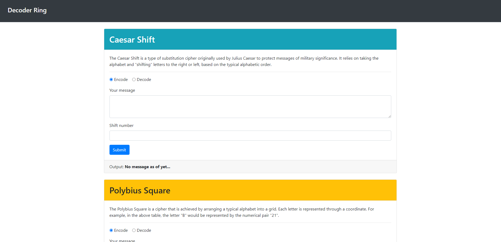

### Decoder-Ring Project

This is a project completed as part of Thinkful's Software Engineering Immersion program. The project is a decoder ring that can encode and decode messages using three different ciphers: Caesar, Polybius, and Substitution. The project was built using JavaScript, HTML, and CSS.

## Caesar Shift

The Caesar Shift is a type of substitution cipher originally used by Julius Caesar to protect messages of military significance. It relies on taking the alphabet and "shifting" letters to the right or left, based on the typical alphabetic order. For example, if you were to "shift" the alphabet to the right by 3, the letter "A" would become "D". To decode the message, you would shift the letters to the left by 3, causing the letter "D" to become "A".

The function takes three parameters: a string to encode, a number to shift the alphabet by, and a boolean to indicate whether to encode or decode the message, returning the encoded or decoded message.

## Polybius Square

The Polybius Square is a cipher that is achieved by arranging a typical alphabet into a grid. Each letter is represented by the coordinates of the grid. For example, the letter "A" would be represented by the coordinates "11". The letter "B" would be represented by the coordinates "12". The letter "C" would be represented by the coordinates "13" and so on. To decode the message, you would take the coordinates and find the letter that corresponds to those coordinates.

The function takes two parameters: a string to encode or decode and a boolean to indicate whether to encode or decode the message, returning the encoded or decoded message.

## Substitution Cipher

The Substitution Cipher is a cipher that takes a typical alphabet and rearranges the letters to create a substitution alphabet. For example, the typical alphabet would be "ABC...XYZ". The substitution alphabet could be "ZYX...CBA". To encode or decode the message, you would take each letter of the message and find the corresponding letter in the substitution alphabet.
The function takes three parameters: a string to encode or decode, a string to use as the substitution alphabet, and a boolean to indicate whether to encode or decode the message, returning the encoded or decoded message.
